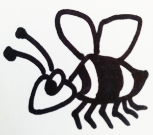

colony
======

A lightweight microservice framework for NSQ. Services can emit and consume data; services can also respond to messages they receive and handle response to messages they emit. 

See the [docs](https://godoc.org/github.com/nytlabs/colony) or the [exmamples](https://github.com/nytlabs/colony/tree/master/example) for more information.
